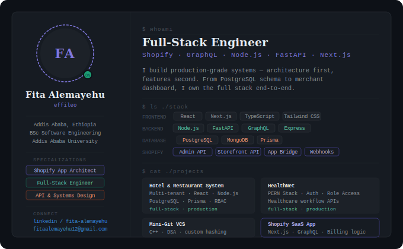

<div align="center">

<!-- STEP 1: Save profile-card.svg to your effileo/effileo repo, then this renders it -->


</div>

---

```javascript
const fita = {
  location:           "Addis Ababa, Ethiopia 🇪🇹",
  education:          "BSc Software Engineering — Addis Ababa University",
  focus:              ["Shopify App Architecture", "Full-Stack Web Apps", "API Systems"],
  currentlyExploring: ["Agentic AI systems", "Advanced system design patterns"],
  beliefs:            "Architecture first. Clean code always. Ship things that last.",
  funFact:            "Built a version control system from scratch in C++.",
};
```

---

## Projects

<table>
<tr>
<td width="50%" valign="top">

### 🏨 Hotel & Restaurant Management System
Full-stack multi-tenant platform for managing hotel branches and services.

`React` `Node.js` `Express` `PostgreSQL` `Prisma`

</td>
<td width="50%" valign="top">

### 🏥 HealthNet
Healthcare management web app — PERN stack with role-based access and secure APIs.

`PostgreSQL` `Express` `React` `Node.js`

</td>
</tr>
<tr>
<td width="50%" valign="top">

### ⚙️ Mini-Git VCS
A version control system built entirely in C++ — custom hashing, linked-list commit history, full state reversion.

`C++` `Data Structures` `Algorithms`

</td>
<td width="50%" valign="top">

### 🛍️ Shopify SaaS App
Production Shopify public app with Admin API, Storefront API, subscription billing, and App Bridge embedded experience.

`Next.js` `Remix` `GraphQL` `Node.js` `PostgreSQL`

</td>
</tr>
</table>

---

## GitHub Stats

<div align="center">


<br/>


</div>

---

<div align="center">

*Designed with precision · Built for scale · Based in Addis Ababa*


</div>
